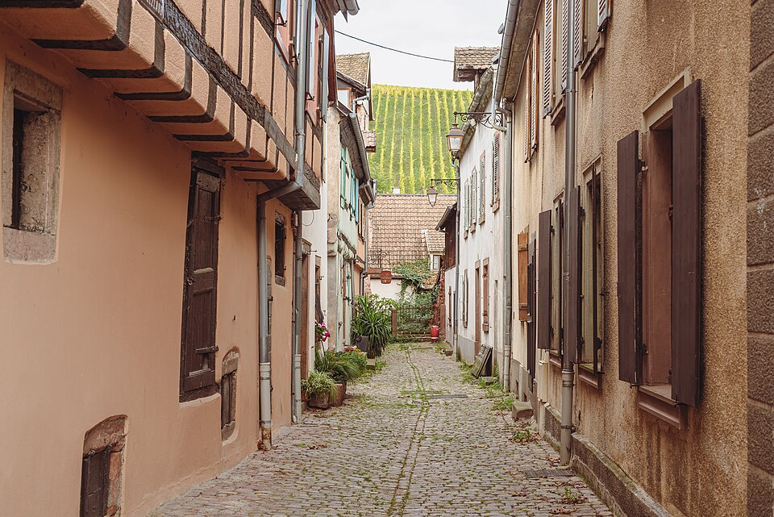
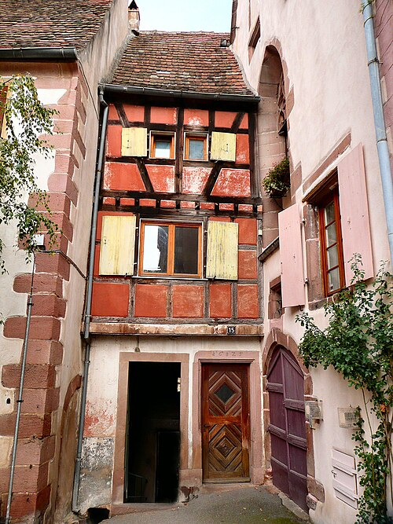
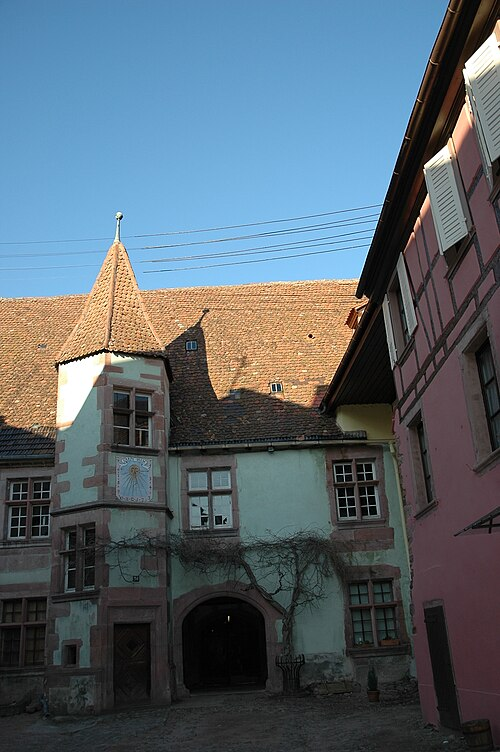
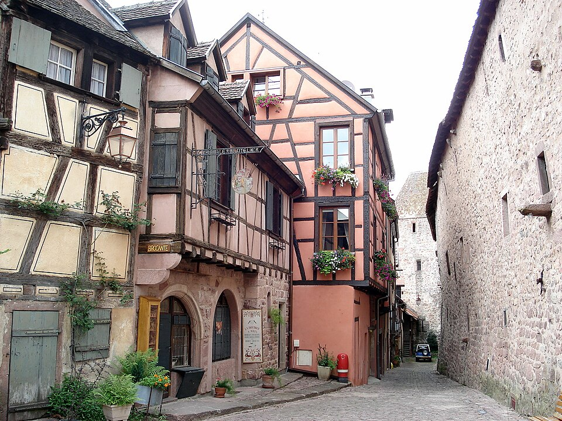
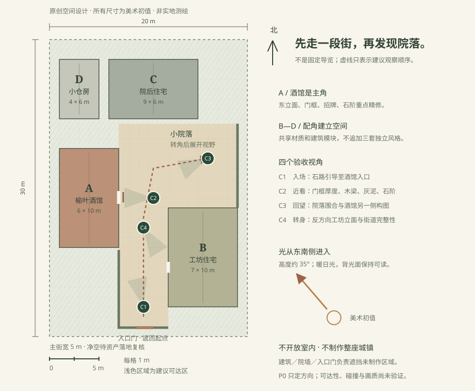

# P0 设计提案：榆叶酒馆街角

> 2026-10-07｜自然写实方向已确认；本提案的参考与布局待用户审阅。  
> 本期仅交付参考板与空间设计；没有把照片、平面图或概念图当作已实现的 3D 画面。

## 1. 设计选择

**建议：阿尔萨斯／莱茵河上游木骨架古镇语汇，原创“短街＋酒馆＋小院落”。**

法国旅游官方介绍将里屈维的木骨架房屋、铺石院落与围墙列为当地景观特征，可作为统一建筑方向的依据。[France.fr](https://www.france.fr/en/article/8-villages-to-sample-along-the-alsace-wine-route/)

本项目取结构与材质，不复制整座里屈维。现代照片含后世改建、电线、车辆与商业设施，不能作为特定中世纪年份的完整证据；目标是可信的古镇氛围，不是历史测绘复原。

候选比较：
- **克制木骨架街角（采用为提案）：**木、灰泥、石材形成丰富对比，范围小也有辨识度。
- 彩色旅游街：容易讨喜，但高饱和墙面、花箱与商业招牌会偏离当前自然写实方向。
- 厚重石砌堡镇：氛围强，但建筑与岩石资产要求不同；本次不混入，以免风格分裂。

## 2. 四张实地参考

照片已按文件页面核对作者与许可，并下载站点缩略图；没有调色或绘改。仅在本地参考板按原比例缩放。完整台账见 [sources.md](sources.md)，机器可读记录含下载地址与 SHA-256：[sources.json](sources.json)。

### R1：街巷尺度

Flocci Nivis / Livia Rasp，[CC BY 4.0](https://creativecommons.org/licenses/by/4.0/)。[来源](https://commons.wikimedia.org/wiki/File:20241004_Rue_Belzlaub_Riquewihr.jpg)。

- 取：近处门窗与墙面的厚度、铺石连续性、建筑围合、少量自然杂草。
- 不取：电线、落水管、消防设施与背景葡萄园；不复制照片的阴天照明。

### R2：木骨架与门洞

Russ Bowling（Flickr: RussBowling），[CC BY 2.0](https://creativecommons.org/licenses/by/2.0/)。[来源](https://commons.wikimedia.org/wiki/File:Riquewihr,_maison,_15_rue_des_Trois-%C3%89glises.jpg)。

- 取：木梁与填充墙的高差、门洞深度、窗框、瓦片搭接。
- 不取：整面高饱和红色、现代标识和落水管；不以照片直接断定建筑为中世纪原状。

### R3：院落层次

Philippe sosson，[CC BY 2.0](https://creativecommons.org/licenses/by/2.0/)。[来源](https://commons.wikimedia.org/wiki/File:Riquewihr,_Cour_de_Berckheim.jpg)。

- 取：高低屋面、入口深色、墙面藤蔓与侧光层次。
- 不取：塔楼、时钟、电线；不把背光墙面压成无细节的黑色。

### R4：街角与招牌

Torsade de pointes，文件页作者声明公有领域（PD-self）。[来源与声明](https://commons.wikimedia.org/wiki/File:Riquewihr_Rue_de_la_Caserne.JPG)。

- 取：木构上层与石砌基座、悬挑招牌、转角遮挡与石墙质感。
- 不取：车辆、现代广告、消防设施、花箱堆叠；不照搬照片的高亮曝光。

## 3. 场景与布局

- 外围 20 × 30 米，并非所有地块都能行走。
- A 酒馆：6 × 10 米，高约 8.5 米；重点制作东立面、入口和南侧转角。
- B 工坊住宅：7 × 10 米，高约 7.5 米；形成街道另一侧，复用模块。
- C 院后住宅：9 × 6 米，高约 8 米；形成屋顶和背景层次。
- D 小仓房：4 × 6 米，高约 5.5 米；低成本配角。
- 主街平面宽约 5 米；道具与石阶落地后，仍须验证净空和碰撞。
- 小院落位于北部转角。建筑、院墙与入口门遮住未制作地块。
- 推荐观察顺序：南侧入场 → 酒馆门前 → 小院 → 回望；未来可自由行走，不是固定镜头路线。
- 全部尺寸是原创美术初值，不是参考照片量测结果。布局数据见 [layout.json](layout.json)。

| 机位 | 用途 | 检查内容 |
|---|---|---|
| C1 入场 | 首屏构图 | 石路引导、酒馆辨识度、前中后景 |
| C2 近看 | 主角细部 | 门框厚度、木梁、灰泥、石阶；后续补约 1 米近景 |
| C3 回望 | 院落观察 | 建筑围合、屋顶高差、酒馆侧向构图 |
| C4 转身 | 非主宣传角度 | 工坊立面、背向空间完整度、不能露出空白地块 |

## 4. 美术基线

- 暖灰泥、旧棕木、低饱和赭墙、灰褐石路、陶瓦、少量叶绿。参考板色卡为人工美术建议，不是测量数据或最终着色器参数。
- 固定晴天；东南侧偏暖日光，太阳高度先按约 35° 试做，背光保留天空补光与细节。这是美术初值，不绑定真实地理时间。
- 相机初值：眼高 1.65 米、垂直视场角 55°；P2 以实机画面调整。
- 石材纹理尺度合理，旧化集中于底部、边缘、接缝；不要全屋均匀撒噪声。
- 招牌暂名“榆叶酒馆”，使用原创叶形图案；不搬用参考商店标识。
- 无浓雾遮丑、强 Bloom、重景深、湿亮滤镜；不以特效弥补主体质量。

## 5. P1 要验证的资产，而不是现在就承诺已拥有

| 优先级 | 资产／模块 | 实际导入时检查 |
|---|---|---|
| 必需 | 同系列木骨架建筑模块或一栋合格主建筑 | 四周和屋顶完整、尺度可调、支持近看、材质可整理 |
| 必需 | 石路、灰泥、旧木、陶瓦 | 合适的 PBR 贴图、纹理尺度、重复感、法线与粗糙度 |
| 必需 | 门窗、石阶、木门 | 实际厚度、阴影与接地，不能只是贴平面 |
| 次要 | 原创招牌、少量桶箱与植物 | 风格统一，不抢主体预算；可由少量定制解决 |
| 工程 | 简化碰撞代理 | 与显示网格变换一致，不让高精细模型直接拖垮物理 |

照片授权只针对参考图片，不等于任意 3D 素材已取得授权。P1 要单独登记模型／纹理来源及浏览器交付适用性；不自动购买付费素材。没有获取到资产时，不静默退回低质量占位模型。

## 6. 本期完成与下一检查点

- 已整理四张实地参考、作者与许可、原创布局、四个检查机位和 P1 资产要求。
- 本地 HTML 参考板是展示设计资料的页面，不是 3D 场景。
- 尚未选定／购买 3D 资产；没有安装渲染依赖，没有训练 3DGS，没有验证成品帧率。
- P0 的“交付已整理”不等于“用户已认可”。待确认：建筑风格、酒馆街角与院落布局、自然暖光和配色。
- 认可后才进入 P1；若需要调整，这一阶段调整代价最低。

入口：[视觉参考板](index.html)。
